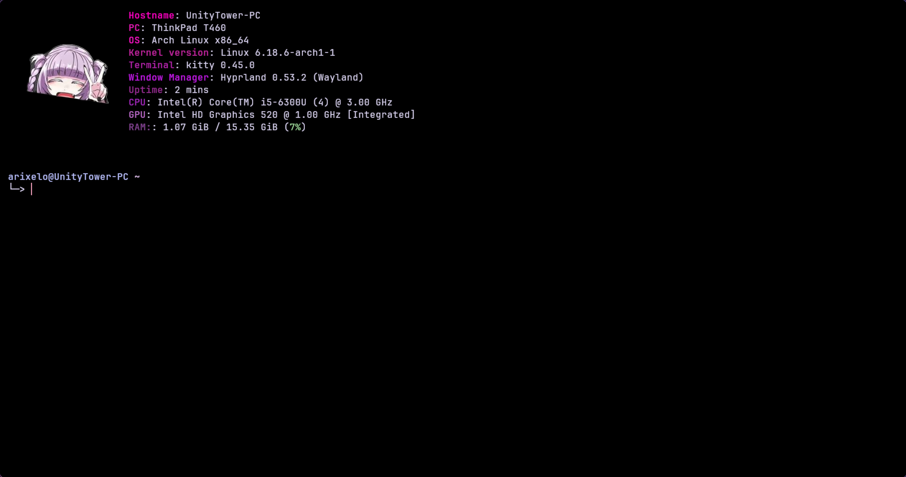
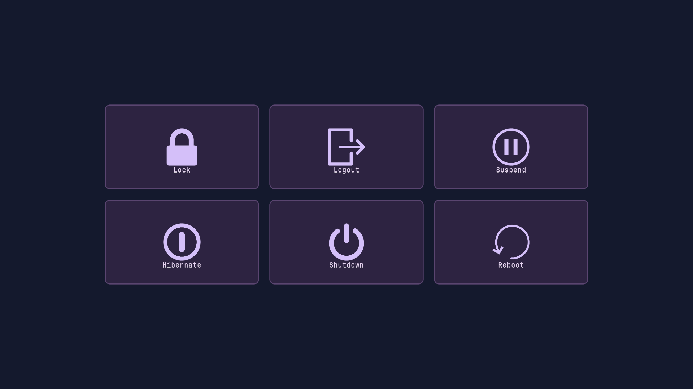
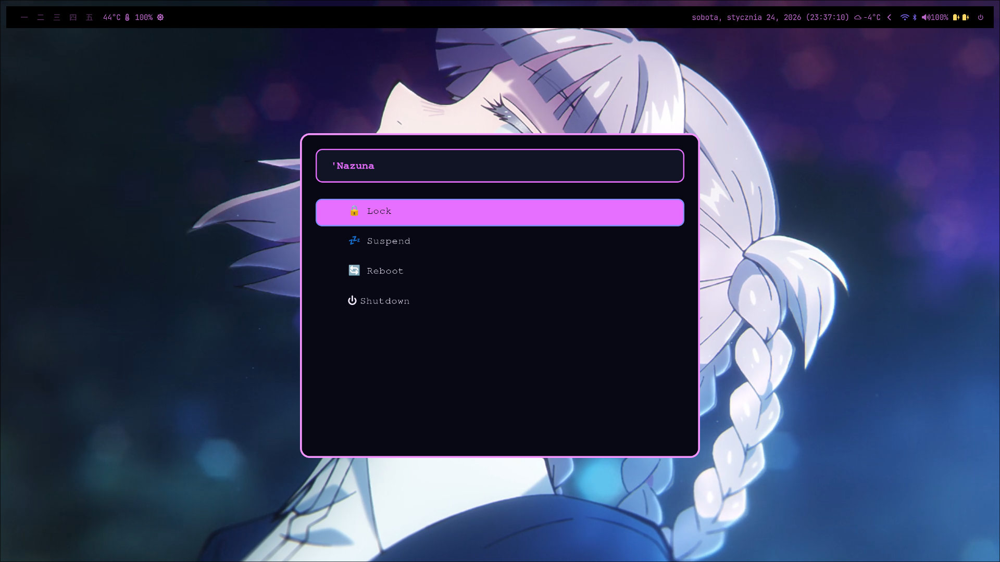

# hyprland-nazuna
**Welcome to my Hyprland config, after making my own [Omarchy distro config](https://github.com/ArixElo/my-omarchy-config), I thought, what if I __try__ making my own Hyprland config for distro that i use for many years, which is Arch. However due to recent AUR incidents, I switched to Gentoo almost a month ago, so a couple things are changed in that branch. So here's my take on making a config inspired by my favourite anime character: Nazuna Nanakusa from Call of the Night. P.S: I spent over 15h doing that config without sleep and eating.**

## Prerequisites and usage guide
- `hyprland` ~ it's obvious.
- `waybar` ~ I liked how Omarchy had their waybar looking, so I went with similiar looks, with some differences.
- `rofi` ~ App launcher with simple looks.
- `wpaperd` ~ for changing wallpapers each reboot, the path will be set to `~/.config/nazuna-walls` but for copyright reasons, i can't post any walls that I use here.
- `hyprshot` ~ for making screenshots.
- `mako` ~ notification daemon.
- `wlogout` ~ Power menu.
- `nautilus` ~ GUI file manager.
- `yazi` ~ TUI file manager.
- `wiremix` ~ Audio managing.
- `battop` ~ Battery stats.
- `nmtui` ~ For managing network connection.
- `bluetui` ~ For Bluetooth management.
- `fastfetch` ~ Displaying system info.
- `tuigreet` ~ Default login manager.
- `cava`  ~ for my theme.
- `linux-wallpaperengine` ~ For using Wallpaper Engine wallpapers (take a note that "puppet" wallpapers don't work properly yet.)
- `wttrbar` ~ for weather in waybar, available on **AUR**,
- `zsh` ~ my favourite shell, with syntax higlighting and autocompletion also with autosuggestions,
- `starship` ~ for the looks in zsh.
- `kitty` ~ Default terminal which I use in that config.

## Important info:
- The branch with lua only config is called `nazuna-lua`, and it will be used by default on version 0.58 of Hyprland since they moved from hyprlang to Lua, and that branch is **Only for Arch** the branch for Gentoo is called: `nazuna-gentoo`.
- **You need to manually change your shell from bash to zsh for your user and root respectively with `chsh` and set `/bin/zsh` after so logout or reboot.**

## Binds
They are exact same as my Omarchy config had, but for the new people let me share them also: 
- `SUPER+ESC` ~ Power menu,
- `SUPER+SPACE` ~ Opens app launcher (rofi),
- `SUPER+A` ~ Opens floating cava visualizer,
- `SUPER+C` ~ Opens VSCode,
- `SUPER+G` ~ Opens Steam,
- `SUPER+U` ~ Opens LACT,
- `SUPER+B` ~ Opens default browser,
- `SUPER+Y` ~ Opens yazi,
- `Print` ~ Screenshot of a app,
- `SUPER+Print` ~ Screenshot of whole window,
- `SUPER+SHIFT+Print` ~ Screenshot of a selected region,
- `SUPER+D` ~ Opens Discord,
- `SUPER+T` ~ Opens Telegram,
- `SUPER+F` ~ Opens File Manager,
- `SUPER+P` ~ Toggles pseudo windows (since Hyprland 0.55+)
- `SUPER+R` ~ Reloads waybar,
- `SUPER+SHIFT+T` ~ toggle floating or tiling mode (default bind is `SUPER+T`, however as you see that is already reserved by Telegram bind),
- `SUPER+SHIFT+F` ~ Goes to fullscreen mode (that's only one shift bind which I sometimes use),
- `SUPER+L` ~ Quick account lock (enter password or use your finger to unlock your desktop),
- `SUPER+M` ~ Opens Pear Desktop (YouTube Music client, however you can change it to your preferred music player),
- `SUPER+/` ~ Opens the keybinds cheatsheet,
- `SUPER+Q` ~ Quit apps.

## Additional info: 
- README will be updated with even more **__info__**, if I get any new idea for things that will make my config experience even better.
- P.S: Feel free to fork, edit or whatever do want to do, however in your's fork README, __i'm kindly asking to include me as the original author.__
- Another info, few things were created with help from Claude AI, which helped me a lot with ideas that I had and might have.
If you encounter any problems, hit me up on: [Telegram](t.me/ArixElo), **Discord**: `arixelo`
Results of my configs:

