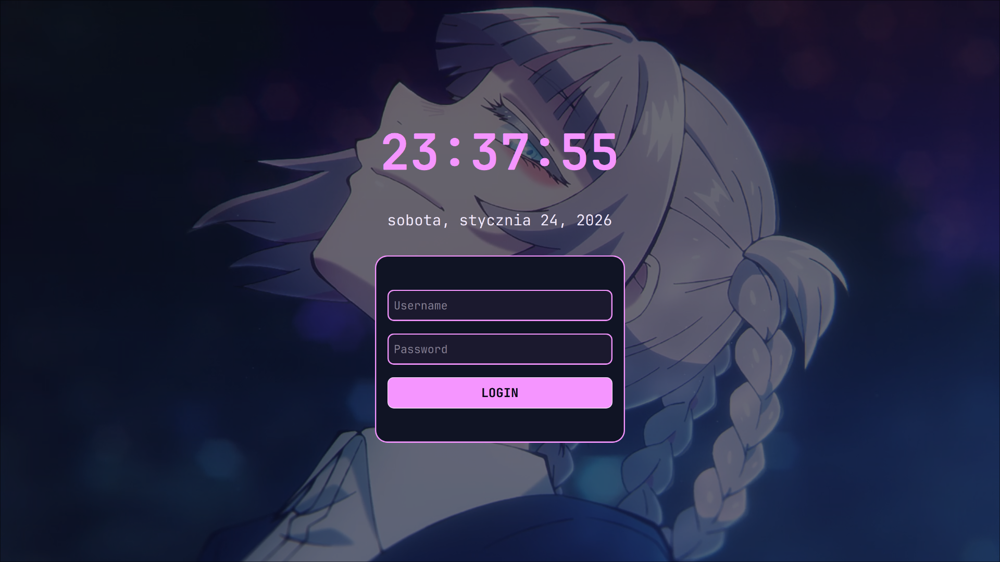

# hyprland-nazuna
**Welcome to my Hyprland config, after making my own [Omarchy distro config](https://github.com/ArixElo/my-omarchy-config), I thought, what if I __try__ making my own Hyprland config for distro that i use for many years, which is Arch. So here's my take on making a config inspired by my favourite anime character: Nazuna Nanakusa from Call of the Night. P.S: I spent over 15h doing that config without sleep and eating.**

## Prerequisites
You need few packages to make it work same like me:
- `hyprland` ~ it's obvious.
- `waybar` ~ I liked how Omarchy had their waybar looking, so I went with similiar looks, with some differences.
- `vicinae` ~ App launcher that have looks and many extensions (for theme you need to copy it into `~/.local/share/vicinae/themes` and apply it from `CTRL+,` menu)
- `wpaperd` ~ for changing wallpapers each reboot, the path will be set to `~/.config/nazuna-walls` but for copyright reasons, i can't post any walls that I use here.
- `hyprshot` ~ for making screenshots.
- `mako` ~ notification daemon.
- `wlogout` ~ Power menu.
- `wiremix` ~ Audio managing.
- `battop` ~ Battery stats.
- `fastfetch` ~ Displaying system info (logos are also gonna be set to `~/.config/nazuna-stickers/`, but for the same reason as walls I can't publish them)
- `sddm` ~ Default login manager, (background.img is removed due to copyright reasons, you can use your own img, and also move the theme to: `/usr/share/sddm/themes/themename` and in `/etc/sddm/sddm.conf` set current theme to that)
- `cava`  ~ for my theme.
- `wttrbar` ~ for weather in waybar, available on **AUR**,
- `zsh` ~ my favourite shell, with syntax higlighting and autocompletion.
- `starship` ~ for the looks in zsh.
- `kitty` ~ Default terminal which I use in that config.

### Dependencies for things to work
- yay (for AUR apps)
- adw-gtk-theme
- qt5ct
- qt6ct
- kvantum
- breeze-icons
- xdg-desktop-portal
- xdg-desktop-portal-hyprland
- hyprland-share-preview-picker (AUR only) 
- network-manager
- bluez

## Binds
They are exact same as my Omarchy config had, but for the new people let me share them also: 
- `SUPER+ESC` ~ Power Menu
- `SUPER+A` ~ Opens floating cava visualizer
- `SUPER+C` ~ Opens VSCode,
- `SUPER+B` ~ Opens default browser
- `SUPER+SHIFT+B` ~ Opens bookmarks searching
- `SUPER+V` ~ Opens clipboard history
- `Print` ~ Screenshot of a app
- `SUPER+Print` ~ Screenshot of whole window
- `SUPER+SHIFT+Print` ~ Screenshot of a selected region
- `SUPER+D` ~ Opens Discord,
- `SUPER+T` ~ Opens Telegram,
- `SUPER+F` ~ Opens File Manager,
- `SUPER+SHIFT+T` ~ toggle floating or tiling mode (default bind is `SUPER+T`, however as you see that is already reserved by Telegram bind)
- `SUPER+SHIFT+F` ~ Goes to fullscreen mode (that's only one shift bind which I sometimes use),
- `SUPER+L` ~ Quick account lock (enter password or use your finger to unlock your desktop)
- `SUPER+M` ~ Opens Pear Desktop (YouTube Music client, however you can change it to your preferred music player),
- `SUPER+Q` ~ Quit apps.

## Additional info: 
- README will be updated with even more **__info__**, if I get any new idea for things that will make my config experience even better.
- P.S: Feel free to fork, edit or whatever do want to do, however in your's fork README, __i'm kindly asking to include me as the original author.__
- Another info, few things were created with help from Claude AI, which helped me a lot with ideas that I had and might have.
If you encounter any problems, hit me up on: [Telegram](t.me/ArixElo), **Discord**: `arixelo`
Results of my configs:

